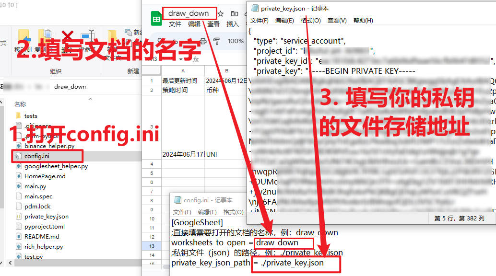

# draw_down

本项目需求来自于「CION情报局」，该社区聚合了多个二级、一级等博主的信息，那么就会涉及到合约，而到底哪一个博主的胜率、盈亏比较好呢？就需要进行回测。

|  回测所需要做的事        | 不借助程序，人需要做 | 借助程序，人需要做 |
|-----------------------|----------------|----------------|
| 抓取该博主的开单信息     | ✅                | ✅                |
| 填入表格                | ✅                | ✅                |
| 在k线中去获取对应的结果 | ✅                | ❌                |
| 填入表格                | ✅                | ❌                |

**运行前**


**运行**


**运行后**


## 开始使用

### 安装编译依赖（可直接下载应用后略过这一小部分）

- python: 3.11

推荐部署流程，先安装Anaconda，然后在Anaconda中的base环境中安装pdm
```commandline
pip install pdm
```
然后在Anaconda的命令行工具中进入当前项目，然后初始化环境，并安装对应依赖
```commandline
pdm init
pdm install
```
若你无法/不想使用上述部署方法。没关系，只需要安装好对应的依赖即可。

### 获取操作google sheet的私钥

[网上教程](https://www.maxlist.xyz/2018/09/25/python_googlesheet_crud/)

### 修改配置文件



### 运行(可直接运行应用)
```commandline
python main.py
```

### 打包命令
```commandline
pyinstaller main.py --onefile
```

## TODO

- [x] 支持通过对谷歌表格上填写的模拟开单进行回测
- [ ] 性能优化，各个表格，各个行（单子）都是独立的。而调用Binance接口的限制来源于IP，所以可以通过多IP，多线程来回测每个单子。
